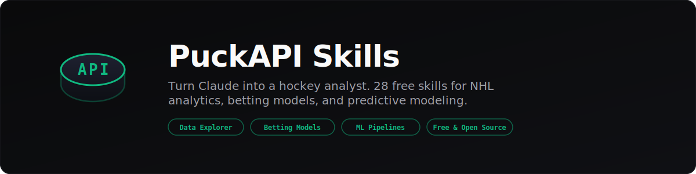

<div align="center">



<br>
<br>

**Turn Claude into a hockey analyst.** 28 free skills covering NHL analytics,<br>betting methodology, and predictive modeling. No code to install.

<br>

[](LICENSE)
[](skills/)
[](https://github.com/PuckAPI/mcp)

[Quick Start](#quick-start) · [All Skills](#skills) · [How It Works](#how-it-works) · [Data](#data) · [Docs](#reference-docs)

</div>

<br>

```
You:    "Build me an expected goals model from shot data"
Claude: [loads xg-model-building skill → walks you through feature selection,
         spatial coordinates, shot type encoding, logistic regression baseline,
         gradient boosting upgrade, calibration, and evaluation]
```

```
You:    "Using PuckAPI, list supported hockey teams, then show today's schedule"
Claude: [uses the MCP server → calls list_teams and get_schedule]
```

## Quick Start

**1. Clone the skills:**

```bash
git clone https://github.com/PuckAPI/claude-sports-analytics.git
```

**2. Connect live hockey data** (optional — 500 free credits):

```bash
claude mcp add puckapi \
  --transport streamable-http \
  "https://mcp.puckapi.com/mcp?key=YOUR_API_KEY"
```

<sub>Get your free key at <a href="https://puckapi.com">puckapi.com</a>. Skills also work with your own CSV/JSON files — no API key needed.</sub>

**3. Ask Claude anything:**

```
"Analyze the Maple Leafs' season — record, Corsi, xG, special teams"
"Help me build a game prediction model"
"Using PuckAPI, list the supported hockey teams, then show today's schedule if games are available"
"Compare McDavid and MacKinnon across every stat"
"Backtest my betting strategy over the last 3 seasons"
```

The `dispatch` skill routes your request to the right 2-3 skills automatically.

---

## Skills

<details open>
<summary><strong>Data Exploration</strong> — 7 skills</summary>

<br>

| Skill | What It Does |
|-------|-------------|
| `game-lookup` | Find games by date, team, season. Scores, schedule, results. |
| `team-analysis` | Standings, advanced stats, strength of schedule, power rankings. |
| `player-scouting` | Player search, comparison, NHLe translation, career trajectory. |
| `goalie-analysis` | GSAA, xSV%, high-danger save rate, workload tracking. |
| `odds-explorer` | Multi-book odds comparison, best price, line movement detection. |
| `nl-to-query` | Translates natural language questions into structured data queries. |
| `game-preview` | Full pre-game breakdown: matchup, goalies, trends, odds, prediction. |

</details>

<details>
<summary><strong>Hockey Analytics</strong> — 2 skills</summary>

<br>

| Skill | What It Does |
|-------|-------------|
| `hockey-analytics` | Corsi, Fenwick, xG, PDO, RAPM, WAR — definitions, context, proper usage. |
| `xg-model-building` | Build an expected goals model from scratch. Feature engineering through calibration. |

</details>

<details>
<summary><strong>Modeling Methodology</strong> — 7 skills</summary>

<br>

| Skill | What It Does |
|-------|-------------|
| `feature-engineering` | Rolling windows, lag features, leakage detection, feature catalogs. |
| `walk-forward-validation` | Temporal cross-validation. Refuses k-fold on time-series data. |
| `model-building` | LR → RF → XGBoost ladder. Hard-vote ensemble. Knows when to stop. |
| `elo-engineering` | 5 Elo variants (standard, margin, venue, recency, surface) with tuning. |
| `probability-calibration` | Platt scaling, isotonic regression, reliability diagrams, Brier decomposition. |
| `odds-analysis` | 4 devigging methods: power, multiplicative, Shin, worst-case. |
| `data-pipeline` | GitHub Actions automation, SQLite schema design, credit budgeting. |

</details>

<details>
<summary><strong>Betting</strong> — 5 skills</summary>

<br>

| Skill | What It Does |
|-------|-------------|
| `edge-detection` | Expected value, Kelly criterion sizing, closing line value tracking. |
| `backtesting` | Walk-forward historical strategy simulation with realistic constraints. |
| `daily-card` | Full slate analysis with edge rankings. Requires your model's probabilities. |
| `bet-tracker` | Log predictions, track P&L, CLV, and test for statistical significance. |
| `visualization` | Calibration plots, edge distributions, player cards, correlation matrices. |

</details>

<details>
<summary><strong>Advanced Models</strong> — 4 skills</summary>

<br>

| Skill | What It Does |
|-------|-------------|
| `totals-modeling` | Over/under prediction. Pace metrics, Poisson distribution, under bias. |
| `prop-modeling` | Player prop projections. TOI-first architecture, same-game parlay correlation. |
| `war-gar-decomposition` | RAPM ridge regression, component GAR, contract surplus valuation. |
| `playoff-simulation` | Monte Carlo bracket simulation. Series pricing, path probabilities. |

</details>

<details>
<summary><strong>Workflow + Infrastructure</strong> — 3 skills</summary>

<br>

| Skill | What It Does |
|-------|-------------|
| `dispatch` | Routes your request to the right skills automatically. Start here. |
| `ai-hockey-workflow` | 4 patterns for hypothesis testing: explore, model, validate, deploy. |
| `puckapi-tool` | MCP tool router. 12 endpoints, credit tracking, BYOD data support. |

</details>

---

## How It Works

Skills are **markdown files, not code**. Each one teaches Claude a specific domain. When you mention a topic, Claude reads the relevant skill and gains that expertise for the conversation.

<table>
<tr>
<td width="50%">

**What each skill includes:**

- When to use / when NOT to use
- Step-by-step methodology
- Python/pandas code templates
- Anti-patterns it actively prevents
- Chaining to the next logical skill

</td>
<td width="50%">

**What skills prevent:**

- k-fold on time-series data
- Future data leakage in features
- Overfitting to small samples
- Wrong devigging methods
- Misinterpreting advanced stats

</td>
</tr>
</table>

---

## Data

| Source | Coverage |
|--------|----------|
| **[PuckAPI MCP](https://github.com/PuckAPI/mcp)** | 22,000+ games · 107,000+ odds records · 3,000+ players · 16 seasons (2010-11 through current) |
| **Your own files** | Every skill accepts CSV/JSON. Bring your own data, no credits needed. |

---

## Reference Docs

| Doc | Contents |
|-----|----------|
| [`hockey-glossary.md`](docs/hockey-glossary.md) | Corsi, Fenwick, xG, PDO, RAPM, WAR |
| [`betting-glossary.md`](docs/betting-glossary.md) | Odds formats, vig, devigging, Kelly, CLV |
| [`tool-routing.md`](docs/tool-routing.md) | Decision tree for picking the right data source |
| [`season-logic.md`](docs/season-logic.md) | NHL season IDs, game ID format, lockout handling |

---

## Contributing

Found an issue with a skill? Have a methodology improvement? PRs welcome.

Skills are markdown files in `skills/[name]/SKILL.md`. Each skill has a consistent structure — follow the existing patterns.

---

<div align="center">

**[PuckAPI MCP Server](https://github.com/PuckAPI/mcp)** · **[puckapi.com](https://puckapi.com)** · **[API Docs](https://puckapi.com/docs)**

<sub>MIT License</sub>

</div>
